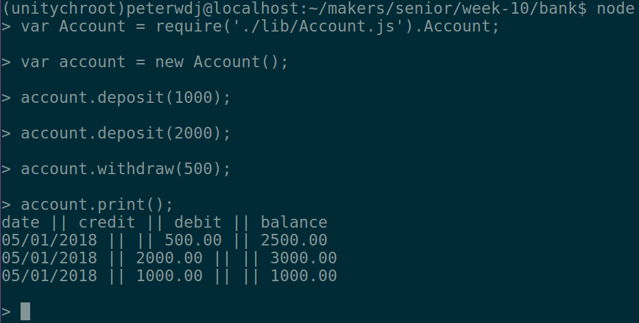

# Bank Tech Test

[Introduction](#introduction) | [Running the App](#running-the-app) | [Running the Test Suite](#running-the-test-suite) | [Approach](#approach) | [Challenges](#challenges) | [Tech Stack](#tech-stack)

## Introduction

This is a simple command-line banking application, written in JavaScript. It is a practice tech test as part of week 10 of the [Makers Academy](http://www.makersacademy.com/) course. The full specification for this project is available [here](https://github.com/peterwdj/bankTechTest/blob/master/specification.md).


## Running the App

To run this app, first clone this repo, then enter into a REPL (such as [Node](https://nodejs.org/en/)) in the command line and require the Account file from the root directory of the project:
```
var Account = require('./lib/Account.js').Account;
```
From here, you can create a new account (`var account = new Account();`), and will be able to carry out the core functions of the application, such as:
```
account.deposit(1000);
account.deposit(2000);
account.withdraw(500);
account.print();
```
These commands will log the following to the console:
```
date || credit || debit || balance
<CURRENT DATE> || || 500.00 || 2500.00
<CURRENT DATE> || 2000.00 || || 3000.00
<CURRENT DATE> || 1000.00 || || 1000.00
```

This looks like the following:


## Running the Test Suite

This application was built using the Jasmine test suite. To run the tests, simply run `jasmine` from the project's root directory. If you do not have Jasmine installed, you will need to [install it](https://www.npmjs.com/package/jasmine). Feature tests were carried out in the Node REPL.


## Approach

I began this project by figuring out which classes I would need to create in order to achieve the specified functionality. I initially settled on an Account, Transaction, and Printer class. The Account class would be responsible for storing the balance and list of a transactions, the Transaction class for modifying the balance and storing the date of any given transaction, and the Printer for printing an account statement. I soon decided to divide the Transaction class into Deposit and Withdrawal classes, primarily in order to more clearly delineate between these two distinct actions. I did so as I had decided that these two classes would be the ones to modify the account balance, and this felt like a better adherence to the single responsibility principle. In practice what this meant, however, was that the account needed to be injected into the Deposit or Withdrawal in order for the balance to be altered which created messy, unscalable code through its interdependency, and also made isolation of tests difficult ([see below](#challenges)). In hindsight, and were I to repeat this exercise, I would modify the account balance from within the Account class, and create Transaction objects within the Account withdraw and deposit functions, storing data about the transaction (such as type, amount, and date), and then store these into an Account transactionLog property.


## Challenges

One of the biggest challenges I faced during this tech test was creating Jasmine spy objects that had properties, as well as functions. These were necessary due to my poorly-designed system, which meant I needed a (real or fake) account object with a balance property in my withdrawal and deposit spec files. To the best of a day's worth of research and attempting things, I have concluded that this functionality is not yet included in Jasmine, and I have [submitted a feature request to the Jasmine GitHub repository](https://github.com/jasmine/jasmine/issues/1474). To work around this, I initially used a real Account object as a temporary workaround, but that meant my tests were not isolated. In my final code, I have used a regular fakeAccount variable with a balance property to resolve this issue. My biggest takeaway from this experience is a better awareness of when to stick and when to twist when I am stuck on a difficult problem; in this instance, I spent far too long pursuing a single problem from the same angle, as I was reticent to 'give up' or admit defeat as I wanted to learn how to solve this problem. The reality, however, is that there was a reason for my struggles: the fact that my code was poorly designed, and attacking the problem in this way was not a wise approach. Had I taken a step back to consider more holistically how the program was evolving, I would likely have come to this realisation sooner.


## Tech Stack

This project was written using the following technologies:
- JavaScript
- Node 4.2.6
- eslint 4.14.0
  - eslint-config-google ^0.9.1
